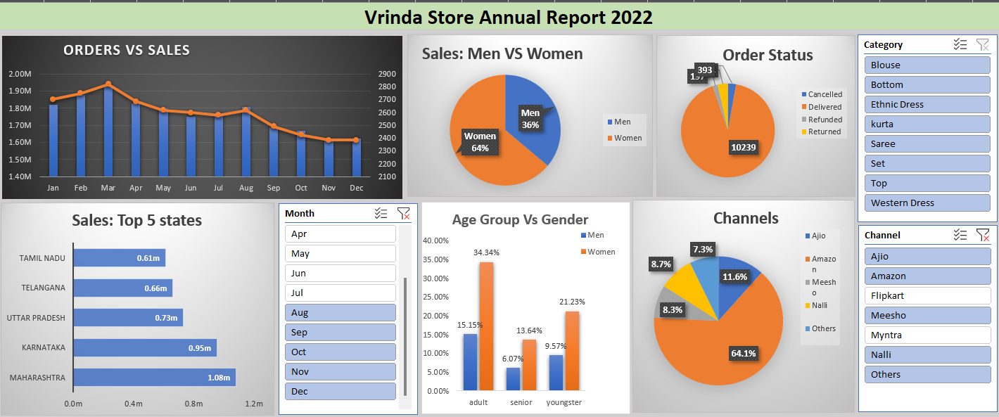

# E-commerce Sales Dashboard in Excel

## Overview
This Excel dashboard provides a comprehensive overview of e-commerce sales performance, focusing on key metrics such as orders vs. sales, top-performing states, sales by gender, age group vs. gender, and sales channels. The dashboard also includes slicers and pivot tables for interactive data exploration.

## Metrics Included
- **Orders vs. Sales**: Comparison of the number of orders to the total sales amount.
- **Top 5 States**: Identifies the top 5 states by sales amount.
- **Sales: Men vs. Women**: Distribution of sales between male and female customers.
- **Age Group vs. Gender**: Sales distribution across different age groups and genders.
- **Sales Channels**: Performance of different sales channels.
- **Slicers**: Filters to interactively explore the data.
- **Pivot Tables**: Detailed data analysis and summaries.

## How to Use the Dashboard

### Data Preparation
Data includes the following fields:
- `Order ID`
- `Date`
- `State`
- `Gender`
- `Age Group`
- `Sales Channel`
- `Sales Amount`
- `Order Quantity`

### Dashboard Components

1. **Orders vs. Sales**
   - Chart comparing the number of orders to the total sales amount.

2. **Top 5 States**
   - Chart highlighting the top 5 states by sales amount.

3. **Sales: Men vs. Women**
   - Chart showing the distribution of sales between male and female customers.

4. **Age Group vs. Gender**
   - Chart displaying sales distribution across different age groups and genders.

5. **Sales Channels**
   - Chart illustrating the performance of different sales channels.

6. **Slicers**
   - Interactive filters for `Date`, `State`, `Gender`, `Age Group`, and `Sales Channel`.

7. **Pivot Tables**
   - Detailed tables summarizing sales data, with filters for in-depth analysis.

